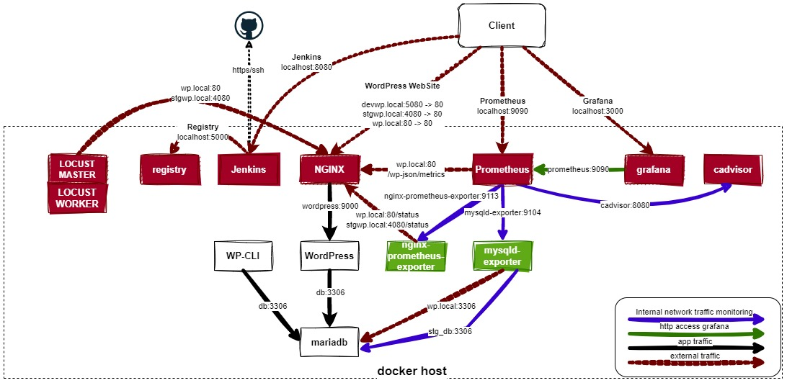

# WordPress autodeploy Project (GeeksHub BootCamp DevOps 2023)

Proyecto BootCamp DevOps 2023

## Introducción

Prueba técnica, consiste en automatizar una aplicación web básica.
Independientemente del lenguaje o framework que se haya utilizado para crearla, realizaremos todo el ciclo de vida de un entorno automatizado, siguiendo el proceso
desde que un desarrollador realiza un push sobre la rama master e inicia el proceso para ponerse automáticamente en producción.

## Requisitos

- Para la aplicación se puede utilizar cualquier lenguaje enfocado en el desarrollo web, python, node.js, php, etc.
- Se deberá disponer de un sistema de integración continua, utilizando git, mediante repositorios en github, bitbucket, etc.
- Las aplicaciones deben estar correctamente dockerizadas, separando la app de la base de datos. Podemos disponer de un front, un back y la bd en tres
contenedores distintos o, también, un modelo más simplificado en un contenedor y disponer de los tres elementos. En este caso, el/la alumno puede decidir qué escoger.
- Se utilizará algún orquestador de contenedores para la gestión, tal como puede ser docker-swarm, docker-compose o kubernetes. Se deberá poder lanzar los procesos en local para comprobar el correcto funcionamiento del mismo.
- Se dispondrá del sistema automatizado de despliegue con los pipelines suficientes, ya sea utilizando jenkins, jenkinsX u otros como CircleCi.
- Se dispondrá de un panel para la motorización de la aplicación (errores, funcionamiento del mismo), si se utiliza docker no es suficiente con utilizar portainer o con k8 cualquier aplicación de visualización minikube etc.. Se debe disponer de un sistema de recogida de información de los contenedores y exposición de los datos del mismo, sobre grafana, kibana o similar.
- Junto con el Proyecto Final, se deberá presentar una memoria donde se justifiquen las decisiones adoptadas y con una clara explicación de la misma.

## Nomenclatura

- prd - entorno de producción.
- stg - entorno de staging.
- dev - entorno de desarrollo.

## Requisitos para el despliegue

- Entorno local con Docker
    - Instalación https://docs.docker.com/engine/install/ubuntu/
    - Solución a problemas de permisos: https://stackoverflow.com/questions/48957195/how-to-fix-docker-got-permission-denied-issue
    - El entorno se ha probado en:
        - Ubuntu 22 LTS
        - Windows 11 con WSL2 (A tener en consideración: https://stackoverflow.com/a/73028795, los ficheros entrypoint.sh en wp-cli o wp-cli-test no se ejecutan, estos ficheros deben de estar configurados como LF y no como CRLF).
   
## Entorno

### Git
- Se utiliza GitHub como repositorio de código en la rama:
    - main --> al modificar sobre esta rama se realizará el despliegue del entorno, salvo error de alguno de los elementos.
- Para el despliegue de la solución integrado con Git se utiliza Jenkins, que requiere configuración previa (se describe el proceso más adelante).
    - A través del trabajo multibranch Jenkins despliegua desde la rama 'main' los 3 entornos.
    
    - También se encarga de desplegar las variables de entorno para los contenedores docker.
    - Despliega las contraseñas a través de su gestor de credenciales a los distintos contenedores.
    

### Monitorización

Para la monitorización del entorno se utilizan los siguientes elementos:
- Prometheus con bbdd tsdb, dado a que no requiere una gran escalabilidad, con el fin de obtener información del entorno de docker, las bases de datos, wordpress y nginx de los entornos de stg y prd.
- cAdvisor se despliega para monitorizar el entorno de docker
- 2 x exporter para mysql/mariadb (stg & prd)
- 2 x exporter para nginx (stg & prd)
- plugin para wordpress que se publica vía nginx (stg & prd)
- La información se muestra a gravés de Grafana.

## Aplicación 

- Wordpress es un gestor de contenido, en el cual se puede utilizar para disponer de una web, un blog, en el que se pueden subir post e imágenes y los usuarios del blog pueden añadir comentarios sobre los posts creados.
- La solución despliega un gestor de contenido que consta de:
    - front-end: nginx
    - back-end:  wordpress
    - base de datos: mariadb
    - configurador del entorno: wp-cli (basado wordpress client + shell script)
    - pruebas del entorno: wp-cli-test (wordpress client + shell script)
    - Las url son accesibles a través de los links:
        - Wordpress Eetorno dev: http://devwp.local:5080
        - Wordpress entorno stg: http://stgwp.local:4080
        - Wordpress entorno prd: http://wp.local:80
        - Grafana: http://<ip_address>:3000
        - Jenkins: http://<ip_address>:8080
        - Registry: http://<ip_address>:5000
        - Prometheus: http://<ip_address>:9090
- En una instalación por defecto, WordPress nos pide seleccionar idioma y a continuación usuario admin, contraseña y dirección de e-mail, una vez instalado, muestra por defecto una página web:

- La solución despliga y configura el entorno con una serie de valores establecidos, idioma, titulo del sitio, configuración de reescritura de urls, usuario, contraseña del administrador, plug-ins, temas, etc, para que no sea necesaria una personalización manual de ninguno de los elementos en cualquiera de los entornos, dev, stg o prd.

### - Entorno dev

- Entorno de desarrollo
- Usa docker compose
- Se genera una red dev-net
- Utiliza volumenes de almacenamiento no persistentes
    - wordpress
    - bbdd
- Se despliega una BBDD
- Se crean el usuario para wordpress y el usuario para el exporter de mariadb con los privilegios necesarios sobre la BBDD.
- Se despliega wordpress que se conecta sobre la BBDD
- Se despliega el frontal nginx que conecta con el backend de wordpress
- La configuración del sitio web, se realiza a través del wp-cli, que es un cliente con un script de arranque que configura el sitio y lo personaliza por defecto con la configuración preestablecida por el script.

- Pruebas del entorno de dev:
    - Las pruebas se realizan a traves de unos scripts shell sobre los contenedores:
        - Se comprueba que el usuario de conexión de wordpress existe en la lista de usuarios. Este usuario se pasa a través de una variable que admite la imagen docker.
        - Se comrpueba que el usuario para la conexión del exporter de prometheus de mariadb existe, este usuario se genera a través de linea de comando al despliegue del contenedor con un script de mysql, que a la vez otorga los permisos necesarios sobre las BBDD.
        - Comprueba que el sitio está instalado correctamente comprobando la url: /wp-admin/install.php que confirma que está configurado. Esta es la url de instalación por defecto, es decir, cuando visitamos por primera vez un sitio wordpress que está sin configurar nos solicita idioma y parametros de usuario y contraseña. También sirve para verificar que hay conexión a la bbdd ya que en caso que no hubiera conexión devolvería un mensaje que no se ha podido conectar con la base de datos, de ahí que no se haya determinado comprobar si la bbdd existe o no a nivel motor de bbdd.

     

    - Pruebas a través del wp-cli-test:
        - Se generan etiquetas y categorías
        - Se generan posts en base un valor fijo configurado en una variable, con unos tiempos de espera en función de lo definido en una variable.
        - Con cada post se sube una imágen aleatoria entre las del repositorio de imagenes.
        - por cada post se generan una serie de comentarios en valor fijo configurado en una variable, también con unos tiempos de espera en función de lo definido en una variable.
        - Al terminar los tests se verifica en total de post creados, comentarios, etiquetas y categorías, si los valores coinciden las pruebas se dan ok.
    - Se espera un tiempo establecido por una variable y se destruye el entorno.
    - En caso de fallo se destruye el entorno y se detiene la ejecución del pipeline.
    - En caso de éxito, se continua con el despliegue del entorno de stg.


### - Entorno stg

- Entorno de staging
- Usa docker compose, el despliegue es similar a la solución de desarrollo, pero añade algunas diferencias.
- Se generan dos redes, una para stg y otra para monitorización:
    - stg-net
    - mon-net
- Utiliza volúmenes persistentes
    - wordpress
    - bbdd
- Al ser volumenes persistentes, la base de datos también lo es, por lo que el contenido creado previo no se elimina, ni se eliminan los contenidos subidos.
- También realiza la configuración del sitio, de la misma forma que en dev, para unificar el entorno vía código.
- Monitorización:
    - En este entorno se incluye una monitorización de peticiones de wordpress, post publicados y mysql.
    - Se despliegan los exporter para monitorización con Prometheus para nginx y mysql.
    - Y se utiliza el plugin de wordpress configurado para monitorizar el entorno.
- Pruebas a través del wp-cli-test:
    - En la parte de pruebas del entorno se cumple lo mismo que para dev, con la diferencia que el contenido se genera de forma aleatoria en el número de posts y comentarios, las variables definen valores máximos, pero se crean en base a un valor aleatorio entre los definidos por las variables.
    - Se realiza una prueba de carga vía locust a la web, generando un master y varios workers.
- En caso de fallo de alguno de los test, se destruye el entorno y se para la ejecución del pipeline, en caso de éxito se mantiene y continua con el despliegue a producción.


### - Entorno prd

- Entorno de producción
- Usa docker-swarm
- Se genera una red overlay:
    - prd-net
- Utiliza volumenes porsistentes:
    - wordpress
    - db
    - db_backup
- Se realiza la configuración del sitio, pero no se genera contenido de pruebas ya que sería visible para todos los usuarios que usan la web de producción.
- Para mantener coexistnecia de todos los entornos, por ejemplo, la instalación de un tema o un nuevo plugin, deberían de realizarse vía código:
    - A modo prueba se puede modificar el fichero ./wp-cli/entrypoint.sh líneas 56 y 57 eliminando los comentarios de las lineas wp plugin activate, esto activan los plugin de akismet y hello-dolly
            ```#### TEST PLUGINS -- Comment / uncomment next line to test deployment
            ## wp plugin activate hello
            ## wp plugin activate akismet
            ```

- Cuando se realiza una modificación de la rama main, se realiza lo siguiente:
    - Se suben las imágenes al registry
    - Se hace un backup de la BBDD en el volumen backup y se almacenan las últimas 5 copias
    - Actualización de imágenes (1 cada 10s definido en el fichero .yml de configuración)
    - El despliegue se realiza con el siguiente número de imágenes en ejecución definido en el fichero .yml de docker compose del entorno.
        - bbdd: 1
        - wordpress: 3
        - nginx: 3
        - wp-cli: 1

- Una vez finalizado se realiza una prueba de carga vía locust, generando peticiones al entorno durante un breve tiempo.

## Configuración del entorno

### - Resolución de nombres:

- Configurar en un dns interno las siguientes entradas de tipo A para que apunten a la ip de la red donde vayamos a ejecutarlo, las siguientes líneas son un ejemplo:
```    devwp.local A 192.168.0.1
    stgwp.local A 192.168.0.1
    wp.local    A 192.168.0.1
```

- En caso de no disponer de DNS modificar el fichero /etc/hosts en linux o C:\Windows\system32\drivers\etc\hosts en Windows, la segunda línea es si lo estamos ejecutando en una máquina de red y reemplazaría la primera:
```    127.0.0.1 localhost
    192.168.0.1 devwp.local   stgwp.local wp.local
```

### - Estructura de directorios:

```    - ./Readme/images           ---> Repositorio de imágenes para fichero Readme.md
    - ./_storage/Jenkins        ---> ficheros locales para Jenkins
    - ./grafana                 ---> dashboard-*.json con los dashboard de Grafana
                                     prometheus_ds.yml datasource de Prometheus
                                     grafana_admin_pwd credenciales de grafana para docker secrets
    - ./jenkins                 ---> Dockerfile para el despliegue de Jenkis
    - ./locust                  ---> prd_locustfile.py para pruebas de carga
                                     stg_locustfile.py para pruebas de carga
                                     Dockerfile para la creación del contenedor
    - ./nginx                   ---> default.conf para la configuración de nginx
                                     Dockerfile para la creación del contenedor
    - ./prometheus              ---> Fichero de configuración de Prometheus
    - ./wp                      ---> Dockerfile para la configuración de la imagen de docker
                                     disable-canonical-redirects.php plugin para la instalación de wordpress
    - ./wp-cli                  ---> Dockerfile para la configuración de la imagen
                                     entrypoint.sh script de inicialización de la máquina
    - ./wp-cli-test             ---> Dockerfile para la configuración de la imagen
                                     entrypoint.sh script de inicialización de la máquina que genera unos test
    - ./wp-cli-test/img         ---> Repositorio de imágenes que usa la imágen de pruebas del entorno.
                                     Se pueden añadir nuevas imágenes ubicando ficheros jpg con nombre wp??.jpg donde ?? es la conescución numérica de los existentes.
    - ./src/support/shellscripts---> Scripts empleados en Jenkins para la ejecución en formato shell script.
                                     dockerstackdeploy.sh script para el despliegue del stack de docker swarm
                                     prd_docker_update_services.sh script para la actualización de servicios de producción
                                     testfunctionwp.sh script para las pruebas de testing, usuarios en BBDD / comprobación de wordpress instalado
    - ./src/support/Jenkins     ---> Fichero altenertivo de Jenkins para un despliegue basado en 3 ramas distintas, dev, stg, main.
```

### - Estructura de ficheros:

```    - ./.env                    ---> Variables de entorno de Grafana.
    - ./docker-compose-svc.yml  ---> Servicios transversales: cadvisor, registry y Jenkins.
    - ./docker-compose-prdmon.yml -> Servicios de monitorización del entorno de producción.
    - ./docker-compose-locust.yml -> Servicios para pruebas de carga del entorno.
    - ./docker-compose.???.yml  ---> Docker compose dev, stg o prd para cada entorno.
    - ./docker-compose.standalone -> Docker compose con la aplicación en ejecución local, requiere cargar el fichero de variables ./.envstandalone
    - ./Jenkinsfile             ---> Fichero jenkinsfile con pipeline para jenkins.
    - ./start-deploy.sh         ---> Fichero de despliegue inicial del entorno completo.
    - ./stop-depoy.sh           ---> Fichero de parada y eliminación del entorno completo.
    - ./start-standalone.sh     ---> Fichero para despliegue standalone para pruebas locales (sin ci/cd) del sitio wordpress.
    - ./stop-standalone.sh      ---> Fichero para parar y eliminar el modo standalone del sitio wordpress.
```

## Ejecución

### Despliegue inicial
- Instalar docker y revisar que tengamos permisos.
- Asegurarse que los script shell tienen permisos +x si se ejecuta desde linux: `chmod 755 ./start-deploy.sh ./stop-deploy.sh ./start-standalone.sh ./stop-standalone.sh`
- Ejecutar el fichero: `./start-deploy.sh`
- Se puede ejecutar la aplicación en un entorno local sin CI/CD ejecutando `./start-standalone.sh`, esto lanza la bbdd, wordpress, nginx, el cliente wp-cli para configurar y el wp-cli-test para generar contenido. Para finalizar el entorno `./stopd-standalone.sh`
- El fichero start-deploy.sh realiza lo siguiente:
    - Solicita credenciales para el usuario admin de Grafana, y la establece en el fichero `/grafana/grafana_admin_pwd` que docker compose la obtiene como secreto de la ruta
    - Despliega Jenkins y facilita la contraseña de admin para el proceso de instalación.
    - Arranca el registro de imagenes

### Configuración de jenkins

- A tener en consideración que Jenkins almacena el contenido en la ruta local del host: ./_storage/jenkins
- El script `./deploy.sh` facilita los pasos a seguir, en todos casos se puede localizar la contraseña de Jenkins de admin mediante el comando: `docker logs Jenkins-svc`
- obtener la contraseña generada con `docker logs Jenkins-svc`
- Instalar los plugins sugeridos
- Crear el usuario admin con contraseña, rellenando otros datos como nombre y dirección de e-mail.
- Establecer la URL http://<ip_address>:8080/
- Hacer clic en "Start using Jenkins"
- Crear un trabajo
    - Multibranch Pipeline
    - Establecer el nombre
    - Como fuente: Git
    - Introducir la ruta http, si es público
    - o bien introducir la ruta SSH y añadir las credenciales con nuestra clave privada de Git
        - Usuario: Nuestro usuario git
        - Privatekey: Nuestra clave
        - Passphrase: Clave de paso de la clave privada
    - Behaviours, comprobar que está la opción "Discover branches"
    - Property strategy: All branches get the same properties
    - Build Configuration: Mode by Jenkinsfile
        - Script Path: Jenkinsfile
    - Scan Multibranch Pipeline Triggers:
        - Seleccionar: Periodically if not otherwise run
        - Interval: Establecer el tiempo, para un entorno de prueba se puede poner un valor bajo de 5 min para que los cambios sucedan nada mas hacer el commit. También puede lanzarse manualmente.
    - Orphaned Item Strategy:
        - Seleccionar: Discard old items
    - Health metrics
        - No se modifica
    - Pipeline Libraries
        - No se modifica
    - En Panel de control -> Administrar Jenkins -> Configuración global de la seguridad
        - Modificar host key verification strategy por el valor más adecuado:
            - Accept first connection
            - Accept manually
            - Utilizar know_hosts
                - Para know hosts es necesario realizar lo siguiente:
                    ```docker exec -it Jenkins-svc /bin/bash
                    $ mkdir $JENKINS_HOME/.ssh
                    $ touch $JENKINS_HOME/.ssh/known_hosts
                    $ ssh-keyscan -t rsa github.com >> $JENKINS_HOME/.ssh/known_hosts
                    ```
        
        
    - Configuración de credenciales en Jenkins 
        - En el gestor de credenciales de Jenkins introducir los usuarios y contraseñas con los siguientes ID establecidos en el fichero jenkinsfile:
            ```- Usuario / Password de la BBDD de Wordpress / MySQL      : WPDB
            - Usuario / Password del portal Wordpress                 : WPPORTAL
            - Usuario / Password de root MySQL                        : MYSQLADMIN
            - Usuario / Password del exporter de MySQL para Prometheus: MYSQLMONUSR
            ```
        
        * Si no se crean los usuarios con estos IDs, el pipeline de Jenkins no se ejecutará correctamente, ya que Jenkins comprueba que los ids existan.
    - En la primeras ejecución, el log nos devolverá un error `Scripts not permitted to use staticMethod com.cloudbees.plugins.credentials.CredentialsMatchers withId java.lang.String. Administrators can decide whether to approve or reject this signature.`
    - Para que el script de obtención de credenciales funcione, es necesario aprobar las siguientes scripts uno a uno vía la ejecución del pipeline y en el link del console log nos lleva hasta el Panel de Control > Administrar Jenkins > ScriptApproval, esta opción no aparece hasta que no se ejecuta el pipeline:
    ```        staticField hudson.security.ACL SYSTEM
        staticMethod com.cloudbees.plugins.credentials.CredentialsMatchers firstOrNull java.lang.Iterable com.cloudbees.plugins.credentials.CredentialsMatcher
        staticMethod com.cloudbees.plugins.credentials.CredentialsMatchers withId java.lang.String
        staticMethod com.cloudbees.plugins.credentials.CredentialsMatchers withUsername java.lang.String
        staticMethod com.cloudbees.plugins.credentials.CredentialsProvider lookupCredentials java.lang.Class hudson.model.ItemGroup org.acegisecurity.Authentication
        staticMethod jenkins.model.Jenkins getInstance
    ```
    - No nos permitirá counstruir el entorno hasta que no se hayan aprobado todos scripts, por lo que deberemos ejecutiar "Construir ahora" hsata que nos habilite la ejecución.
    
    

### Grafana

- No requiere configuración adicional, se importa una configuración fija desde fichero.
- Acceder a grafana http://<ip_address>:3000
- Acceder con las credenciales
    - Usuario: admin
    - Password: Contraseña establecida en el script de inicio (./start-deploy.sh)
- Grafana permite monitorizar los parámetros del entorno de stg y prd
- Se puede acceder a los dashboard preconfigurados:
    - Docker cAdvisor
    - MariaDB
    - WordPress


### Configuración de Prometheus

- No requiere configuración adicional, se importan las configuraciones desde fichero.
- Se puede acceder a Prometheus desde la url http://<ip_address>:9090
- Prometheus usa la red mon-net para conectar con los distintos elmentos del entorno de monitorización.

### Configuración de cadvisor

- No requiere de configuración adicional.
- cAdvisor solamente es accesible vía Grafana, no se puede usar la url http://<ip_address>:8080 para el acceso desde el exterior.
- Usa la red mon-net para conectar con los distintos elmentos del entorno.


### Registro de imágenes

- Se realiza el acceso vía localhost sin credenciales.

## Esquema de volumenes de almacenamiento

- NGINX, WordPress, WordPress-cli y WordPress-cli-test:
    - requieren de un volumen de disco compartido de acceso a los datos.
    - dev, el disco no es persistente, pero para su funcionamiento ha de estar compartido.
    - stg y prd, los volumenes son persistentes.
- Mariadb
    - dev, los volumenes son no persistentes.
    - stg, tiene un volumen persistente
    - prd, tiene asignados 2 volúmenes uno para las bbdd y otro para backup.
- Jenkins
    - utiliza un volumen de almacenamiento local de la máquina que lo ejecuta.
- Registry
    - utiliza un volumen persistnete.
- Prometheus
    - usa también un volumen persistente para almacenar los datos.

La siguiente imagen muestra como sería el almacenamiento del entorno:


## Esquema de red

- dev-net
    - red para el entorno dev.
- stg-net
    - red para el entorno stg.
    - algunos contenedores (como nginx y mysql) están conectadas también a la red mon-net.
- prd-net
    - red overlay para los elementos de producción.
- svc-net
    - red para servicios transversales (jenkins, registry)
- mon
    - red de Grafana, exporters para Prometheus y Prometheus, así como los contenedores de stg antes mencionados.

- El siguiente esquema simplifica como se gestiona el tráfico en prd.


## Puntos de mejora / Pendientes / Conclusiones
- Base de datos
    - Sin alta disponibilidad ni redundancia
    - Sería recomendable configurar al menos un cluster de 2 o 3 nodos, eso permitiría actualizaciones no disruptivas sobre el contenedor de la BBDD.
    - Limitar la exposición del puerto 3306 de la base de datos al exterior para su monitorización y que no sea accesible desde el exterior, actualmente se utiliza para el exporter de monitorización.

- Monitorización del entorno:
    - Monitorización básica del entorno en la que no hay alertas configuradas, solamente se obtienen métricas.
    - Cadvisor, se ha implementado, aunque sería prescindible aunque esta solución a fecha de hoy está en fase de desarrollo: https://docs.docker.com/config/daemon/prometheus/

- Seguridad
    - Cifrado
        - No hay un despliegue de certificados ni uso de https como protocolos de acceso.
        - Tampoco hay cifrado en el transporte de las comunicaciones de las BBDD.
        - Sería recomendable implementar https y cifrado TLS en las comunicaciones con algoritmo de cifrados actuales.
        - La entrega de certificados debería gestionarse de forma segura con alguna gestión de secretos/contraseñas.
    - Gestión de contraseñas y secretos
        - Mejorarlo con un gestor de contraseñas externo, se ha utilizado Jenkins por unificar los elementos del entorno local.
        - Por simplificar la configuración del despliegue en Jenkins y a modo muestra, se han utilizado las mismas credenciales para los distintos entornos, pero sería recomendable utilizar contraseñas distintas para cada uno de ellos.
        - Se ha utilizado docker secrets en Grafana para no utilizar un fichero con variables de entorno con contraseñas y evitar propagación a otros contenedores, pero al almacenarse en fichero con texto plano no da una capa de seguridad adicional al menos en docker-compose.
        - Mejorar el despliegue de Jenkins, para evitar la solicitud de aprobación de scripts.
        - En la medida de lo posible, se ha tratado de otorgar los mínimos privilegios posibles a los usuarios/servicios como por ej. al usuario exporter de mysql para Prometheus.
    - Gestión de logs y trazabilidad de eventos
        - No se ha incluido la parte de gestión de logs del entorno. Es una tarea pendiente.
    - Puesta en marcha del entorno
        - Se ha intentado que en la puesta en marcha el usuario final tenga que realizar la mínima parte del despliegue y configuración del entorno, aunque como se ha comentado, requiere una configuración de Jenkins para el despliegue.
        - Automatizar el proceso de configuración de Jenkins, también como mejora.
    - Uso de variables
        - Se ha intentado gestionar los entornos con el uso de variables para simplificar futuras configuraciones, usos o aplicaciones para poder personalizar o trasladar el entorno.
        - También estería pendiente reducir el número de variables usadas, simplificando el uso de algunas de ellas o evitando duplicidades.
    - Código
        - No se ha aplicado ninguna herramienta para revisión de código, sería otro punto de mejora a aplicar.
    - Red
        - Se ha intentado minimizar la exposición de puertos al exterior y se ha tratado de utilizar las comunicaciones internas dentro del host (se adjunta esquema con la solución aplicada).
        - Respecto a los exporters para nginx/wordpress no están securizados y serían accesibles desde el exterior. No muestran información sensible, pero como punto de mejora habría que limitar el acceso y la exposición a esos datos a través de la configuración del fichero de configuración.
    - Registro de imágenes
        - Se usa vía localhost sin autenticación y seguridad, recomendado solo para pruebas como dice la web de docker.
        - Sería recomendable requerir autenticación y habilitar certificados para la comunicación.

- Pruebas de carga:
    - Determina 3 posibles errores:
        - Tasa de error de peticiones totales > 1%
        - Respuesta media > 5s
        - Percentil 95% > 5s
    - Se define en este punto, aunque es compartido con el punto anterior de uso de variables:
        - Estaría pendiente mejorar la parte de python con la parte de pruebas de carga y disponer de esos valores unificados y configurar el input con una variable, tanto para el fichero de jenkinsfile como para los ficheros .py que usa Locust.
        - Sería recomendable utilizar variables para la gestión y no valores fijos en el código tal y como está ahora.
    - Docker swarm no dispone de autoescalado.
    - Independientemente del autoescalado, como problema se ha detectado que al realizar las pruebas de carga, el backend de WordPress hace que la CPU del host al 100% de uso con 50 usuarios de prueba, esto hace que se disparen los tiempos de respuesta en los resultados.
        - En el entorno de stg que solo hay un nodo backend de WordPress dispara la CPU del host. A tener en cuenta que el entorno de stg se realizan consultas por categorías.
        - En el enotrno de prd que hay 3 nodos backend de WordPress, la carga de CPU del host donde se ejecuta es similar en ambos casos, pero se puede observar como se reparte la carga entre los 3 contenedores. A tener en cuenta que hay menos contenido de consulta, pero se producen unas 1300 consultas sobre la BBDD en cada caso.
        - En este caso como conclusión al cuello de botella en este caso estaría en el host, de ahí los tiempos de respuesta elevados, estos tiempos se han mejorado haciendo un escalado vertical de la máquina (añadiendo más vCPU)
        - Como mejora sería la implementación en una solución cloud con un autoescalado de los elementos, también se podría utilizar otro nodo que gestionara Jenkins donde desplegar Locust con los workers y master.
        - Si se ejecuta localmente dependerá de la máquina y capacidad de proceso de la misma, se recomienda revisar los valores en los ficheros ./prd_locustfile.py y ./stg_locustfile.py así como los mensajes de output, también los valores en el fichero ./Jenkinsfile línea: `export LOCUST_AVERAGE_RESPONSE=5000` y `export LOCUST_PERCENTILE_RESPONSE=5000`, o bien comentar las líneas del fichero ./Jenkinsfile que contienen el if/elif que hacen alusión a las condiciones de la función loadtestfunction() comentandolas con un # para que no apliquen. 
        - Las pruebas actuales se realizan con 50 usuarios durante 90 seg y los valores configurados son 5000ms.

    
    
    - Resultado ejemplo stg:
    ```Type     Name  # reqs      # fails |    Avg     Min     Max    Med |   req/s  failures/s
    --------||-------|-------------|-------|-------|-------|-------|--------|-----------
    GET      /        221     0(0.00%) |   1441     157    2217   1800 |    2.46        0.00
    GET      /blog/category/contentstg1/     216     0(0.00%) |   1438     126    2280   1700 |    2.40        0.00
    GET      /blog/category/contentstg10/     176     0(0.00%) |   1530     130    2162   1800 |    1.96        0.00
    GET      /blog/category/contentstg2/     212     0(0.00%) |   1452     136    2304   1800 |    2.36        0.00
    GET      /blog/category/contentstg3/     206     0(0.00%) |   1445     133    2240   1800 |    2.29        0.00
    GET      /blog/category/contentstg4/     203     0(0.00%) |   1457     131    2184   1800 |    2.26        0.00
    GET      /blog/category/contentstg5/     199     0(0.00%) |   1481     133    2150   1800 |    2.21        0.00
    GET      /blog/category/contentstg6/     194     0(0.00%) |   1487     131    2269   1800 |    2.16        0.00
    GET      /blog/category/contentstg7/     191     0(0.00%) |   1510     146    2224   1800 |    2.12        0.00
    GET      /blog/category/contentstg8/     184     0(0.00%) |   1501     132    2261   1800 |    2.04        0.00
    GET      /blog/category/contentstg9/     181     0(0.00%) |   1516     134    2292   1800 |    2.01        0.00
    --------||-------|-------------|-------|-------|-------|-------|--------|-----------
            Aggregated    2183     0(0.00%) |   1476     126    2304   1800 |   24.26        0.00

    Response time percentiles (approximated)
    Type     Name      50%    66%    75%    80%    90%    95%    98%    99%  99.9% 99.99%   100% # reqs
    --------||--------|------|------|------|------|------|------|------|------|------|------|------
    GET      /     1800   1900   2000   2000   2100   2100   2200   2200   2200   2200   2200    221
    GET      /blog/category/contentstg1/     1700   1800   1900   2000   2100   2100   2100   2100   2300   2300   2300    216
    GET      /blog/category/contentstg10/     1800   1900   2000   2000   2000   2100   2100   2200   2200   2200   2200    176
    GET      /blog/category/contentstg2/     1800   1900   2000   2000   2100   2100   2100   2200   2300   2300   2300    212
    GET      /blog/category/contentstg3/     1800   1900   1900   2000   2100   2100   2100   2200   2200   2200   2200    206
    GET      /blog/category/contentstg4/     1800   1900   1900   2000   2000   2100   2100   2100   2200   2200   2200    203
    GET      /blog/category/contentstg5/     1800   1900   2000   2000   2100   2100   2100   2100   2200   2200   2200    199
    GET      /blog/category/contentstg6/     1800   1900   1900   2000   2000   2100   2200   2200   2300   2300   2300    194
    GET      /blog/category/contentstg7/     1800   1900   2000   2000   2100   2100   2200   2200   2200   2200   2200    191
    GET      /blog/category/contentstg8/     1800   1900   1900   2000   2000   2100   2100   2200   2300   2300   2300    184
    GET      /blog/category/contentstg9/     1800   1900   2000   2000   2100   2100   2100   2200   2300   2300   2300    181
    --------||--------|------|------|------|------|------|------|------|------|------|------|------
            Aggregated     1800   1900   2000   2000   2100   2100   2100   2200   2300   2300   2300   2183
    ```

    - Resultados ejemplo prd:

    ```
    Type     Name  # reqs      # fails |    Avg     Min     Max    Med |   req/s  failures/s
    --------||-------|-------------|-------|-------|-------|-------|--------|-----------
    GET      /       2883     0(0.00%) |   1118      96    2655   1100 |   32.03        0.00
    --------||-------|-------------|-------|-------|-------|-------|--------|-----------
            Aggregated    2883     0(0.00%) |   1118      96    2655   1100 |   32.03        0.00

    Response time percentiles (approximated)
    Type     Name      50%    66%    75%    80%    90%    95%    98%    99%  99.9% 99.99%   100% # reqs
    --------||--------|------|------|------|------|------|------|------|------|------|------|------
    GET      /     1100   1300   1500   1600   2000   2200   2300   2400   2600   2700   2700   2883
    --------||--------|------|------|------|------|------|------|------|------|------|------|------
            Aggregated     1100   1300   1500   1600   2000   2200   2300   2400   2600   2700   2700   2883
    ```

## Recursos adicionales

### Jenkinsfile con varias ramas Git

- Como alternativa al despliegue desde una sola rama, se ha creado un Pipeline de Jenkins (el fichero se puede localizar bajo la ruta ./src/supportJenkins/Jenkinsfile) dónde se realiza el despliegue del entorno en paralelo en función de la rama.
- Consiste en tener varias ramas, en este caso dev, stg y main y en función de la rama en la que se hacen modificaciones se haría un despliegue, las modificaciones a stg y main deberían de ser vía pull request:


